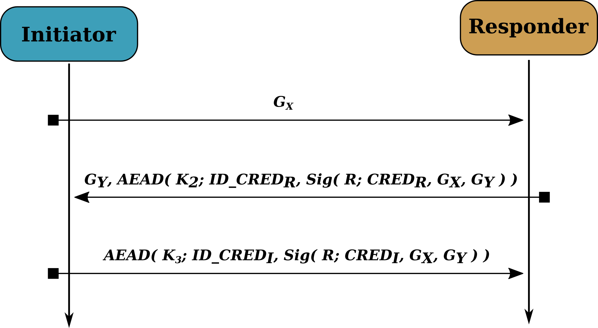

.. edhoc documentation master file, created by
   sphinx-quickstart on Tue Nov 10 09:40:41 2020.
   You can adapt this file completely to your liking, but it should at least
   contain the root `toctree` directive.

***********************************************************************
``edhoc`` a Python implementation of Ephemeral Diffie-Hellman Over COSE
***********************************************************************

What is EDHOC?
--------------

Ephemeral Diffie-Hellman Over COSE (EDHOC_) is a lightweight key exchange protocol aimed at constrained devices
(e.g., IoT devices). On successful execution of the EDHOC protocol two devices agree on a shared secret, which is
subsequently used to encrypt application data between the devices. Unlike TLS (Transport Layer Security) which
consists of both a handshake protocol (to derive a shared secret) and a record layer protocol (to encrypt application
data), EDHOC only performs the key exchange. Encryption of application data is delegated to other protocols such as
OSCORE_. EDHOC requires a transport protocol that provides reliability to transfer the messages between the devices,
for example CoAP or TCP.

.. warning::

   The EHDOC specification is still under active development at the IETF (Internet Engineering Task Force). Currently
   this package implements draft-02_ of the specification. We aim to follow the development of the specification and
   update the code and API accordingly. Note that this might imply backwards-incompatible changes to the API.

Table of Contents
-----------------

.. toctree::
   :maxdepth: 2
   :caption: The edhoc package (API):

   edhoc/messages/index.rst
   edhoc/roles/index.rst

.. toctree::
   :maxdepth: 2
   :caption: Miscellaneous

   installation.rst
   examples.rst
   LICENSE.rst
   CONTRIBUTING.rst
   glossary.rst

Indices and tables
==================

* :ref:`genindex`
* :ref:`modindex`
* :ref:`search`

.. _EDHOC: https://github.com/lake-wg/edhoc
.. _OSCORE: https://tools.ietf.org/html/rfc8613
.. _draft-02: https://tools.ietf.org/html/draft-ietf-lake-edhoc-02